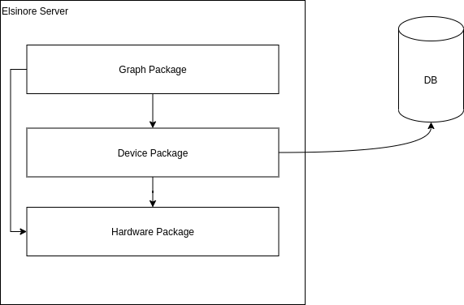
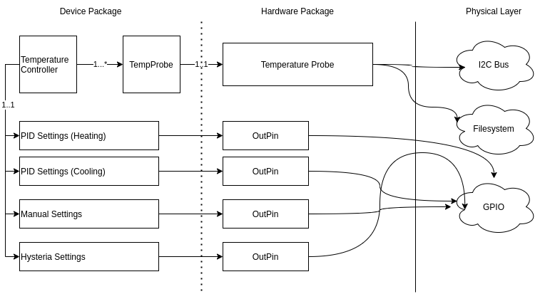

# Architecture

This application is designed to focus purely on providing a [GraphQL](https://graphql.org/learn/) interface for a Brewing Controller, as such, it is heavily opinionated and focused on simplicity of interacting with.

Note: This is my first time writing in Go, so I am probably making mistakes for which any feedback is appreciated

I've taken the approach of using packages for isolation

The `graph` package defines the GraphQL API, it is written in a [Schema First](https://blog.logrocket.com/code-first-vs-schema-first-development-graphql/) approach using [99Designs/gqlgen](https://github.com/99designs/gqlgen)

The `device` package contains the *mental* model of objects, these are persisted to the database, so things like settings, temperature controllers, PID settings, switches and so on live in this package.

The `hardware` package represents the physical layer to the hardware, data in this layer should *not* be persisted to the Database, however, it can be queried from GraphQL for configuration.

## Temperature Controllers

A **TemperatureController** represents a series of objects that can be used to control one or more outputs to control temperature. It can have 1 or more **TempProbe** devices (that each relate to one **TemperatureProbe** hardware device), the **PIDSettings** struct is used as a Heating and Cooling configuration, the **ManualSettings** struct allows manual override of outputs, and **HysteriaSettings** allow the basic temperature controller technique of turning on/off outputs when the temperature hits a certain boundary.
